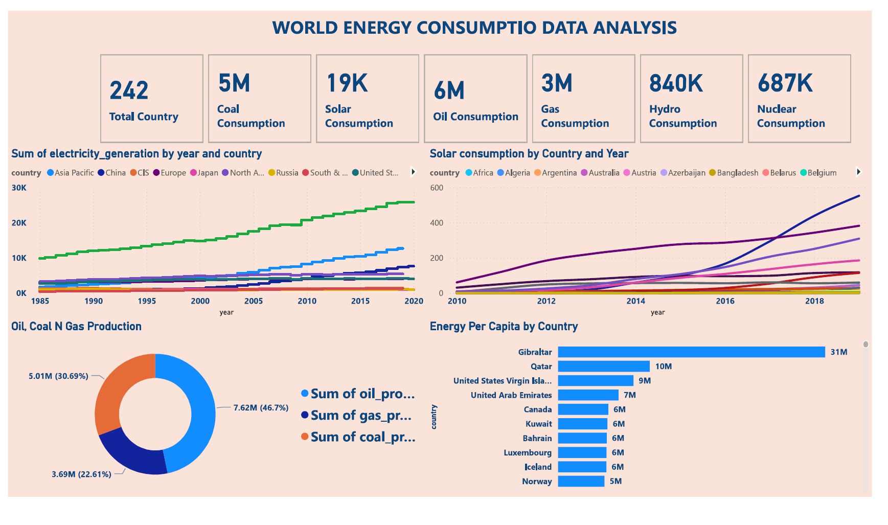

# 🌍 World Energy Consumption Data Analysis

## 🧾 Overview

This dashboard provides a comprehensive global overview of **energy consumption and production trends** across countries and continents, spanning oil, coal, gas, solar, nuclear, and hydroelectric sources. It is ideal for energy policy analysts, environmental researchers, and global economic planners.

---

## ⚡️ Key Highlights

* **242 Countries** covered in the dataset
* **Energy Consumption by Source**:

  * 🏭 **Coal**: 5M
  * ☀️ **Solar**: 19K
  * 🛢 **Oil**: 6M
  * 🔥 **Gas**: 3M
  * 💧 **Hydro**: 840K
  * ☢ **Nuclear**: 687K

---

## 📊 Visual Insights

### 🔌 Electricity Generation by Year and Region (1985–2020)

* Steady increase across regions, especially in **Asia Pacific**, **China**, and **Europe**.
* The United States shows consistent generation with slower growth.

### ☀️ Solar Consumption by Country (2010–2020)

* Significant increase in **Australia**, **Argentina**, and **Algeria**.
* Marked rise post-2015, indicating global adoption of renewable energy.

### 🛢 Oil, Coal & Gas Production Distribution

* **Oil** production leads at 46.7% (7.62M)
* Followed by **Coal** (5.01M, 30.69%) and **Gas** (3.69M, 22.61%)

### ⚖ Energy Consumption Per Capita

Top consumers per capita:

* **Gibraltar**: 31M
* **Qatar**: 10M
* **U.S. Virgin Islands**: 9M
* High consumption also in **UAE**, **Canada**, **Kuwait**, **Iceland**

---

## 🛠️ Built With

* **Power BI** for interactive dashboards
* World Bank, IEA, and open energy datasets

---

## 💼 Use Cases

* Analyze global energy policy trends
* Compare renewable vs non-renewable growth
* Plan future energy investments or sustainability strategies
* Understand consumption patterns by geography and development level

